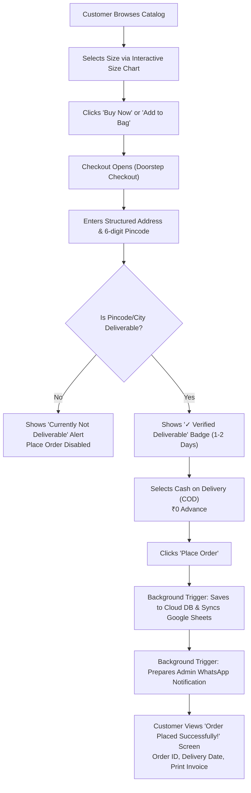

# 🌊 WRON_WAVE CLOTHING — E-Commerce System & Administrator Guide

This document provides a comprehensive guide to all the features, customer order workflows, deliverability rules, Cash on Delivery (COD) processing, and administration controls implemented in the **WRON_WAVE CLOTHING** platform.

---

## 📌 Table of Contents
1. [Core Architecture & Philosophy](#1-core-architecture--philosophy)
2. [Customer Order Flow (100% On-Site E-Commerce)](#2-customer-order-flow-100-on-site-e-commerce)
3. [Structured Address Format & Validation](#3-structured-address-format--validation)
4. [Deliverable Locations & Pincode Protection](#4-deliverable-locations--pincode-protection)
5. [Payment Method: Cash on Delivery (COD)](#5-payment-method-cash-on-delivery-cod)
6. [Order Placed Confirmation & Invoice Printing](#6-order-placed-confirmation--invoice-printing)
7. [Administrator WhatsApp & Backend Notification Triggers](#7-administrator-whatsapp--backend-notification-triggers)
8. [Store Management (Admin Portal)](#8-store-management-admin-portal)
9. [Catalog & Real Photoshoot Drops](#9-catalog--real-photoshoot-drops)
10. [Local & Live Production Access](#10-local--live-production-access)

---

## 1. Core Architecture & Philosophy

Previously, social commerce websites relied on forcibly redirecting customers away to WhatsApp, Instagram DM, or Telegram.

**The New WRON_WAVE E-Commerce System**:
* Customers stay **100% on your website** from browsing to order completion, mirroring modern e-commerce giants (Myntra, Ajio, Zara).
* External app redirects are **completely removed** from the customer path.
* Order storage, inventory tracking, deliverability validation, and administrator notifications are executed **seamlessly in the background**.

---

## 2. Customer Order Flow (100% On-Site E-Commerce)



---

## 3. Structured Address Format & Validation

The checkout form enforces standard Indian e-commerce address fields to eliminate delivery failures and courier returns:

| Field Name | Description | Validation Rule |
| :--- | :--- | :--- |
| **Full Name** | Recipient's legal or delivery name | Required (Minimum 3 characters) |
| **Mobile Number** | 10-digit Indian mobile number | Required (`^[6-9]\d{9}$`, e.g. `9848012345`) |
| **Alternate Phone** | Secondary contact for delivery rider | Optional (10 digits) |
| **Flat / Building** | Flat number, house number, floor, building name | Required (e.g. *Flat 402, Signature Towers*) |
| **Street / Area** | Colony, road number, sector, landmark | Required (e.g. *Road No 36, Jubilee Hills*) |
| **Landmark** | Prominent nearby location | Optional (e.g. *Near Metro Station / D-Mart*) |
| **City** | Customer delivery city | Selected / Validated against Deliverable Cities list |
| **State** | Indian state | Defaults to *Telangana* (Selectable) |
| **Pincode** | 6-digit postal code | Required (`^\d{6}$`). Auto-triggers instant deliverability check! |
| **Address Type** | Delivery timing classification | *Home* (All day delivery) / *Work* (10 AM - 6 PM) / *Other* |

---

## 4. Deliverable Locations & Pincode Protection

The website includes a real-time deliverability engine that protects you from receiving orders in areas where you cannot deliver:

### A. Default Deliverable Zones:
* **Cities**:
  1. `Hyderabad` (1-2 Days Turnaround • Same-Day Express Available)
  2. `Secunderabad` (1-2 Days Turnaround)
  3. `Cyberabad` (Hitec City, Madhapur, Gachibowli, Kondapur)
* **Pincode Coverage**:
  * All Hyderabad `500xxx` pincode ranges (`500001` through `500099`).
  * Custom pincodes (`500081`, `500032`, `500033`, `500072`, `500084`, etc.).

### B. Customer Feedback States:
1. **When Deliverable**:
   * Displays a green verified banner:
     > `✓ Verified Deliverable! Doorstep Cash on Delivery available (1-2 Days).`
   * "Place Order" button is enabled with smooth hover animations.
2. **When NOT Deliverable**:
   * Displays an immediate high-contrast alert:
     > `❌ Currently not deliverable to [Entered City / Pincode]. We currently deliver exclusively to: Hyderabad, Secunderabad, Cyberabad (Pincodes 500xxx).`
   * "Place Order" button is disabled to prevent unserviceable orders.

### C. Administrator Control:
* As the store owner, you can **turn All-India delivery ON or OFF with 1 click** in the Admin Portal!
* You can add any city (e.g. *Bangalore*, *Mumbai*, *Delhi*) or specific 6-digit pincodes anytime.

---

## 5. Payment Method: Cash on Delivery (COD)

As requested, the checkout currently runs on a trusted, customer-friendly **Cash on Delivery (COD)** model:
* **₹0 Advance Payment**: Zero risk for the customer; customers pay when the physical t-shirt arrives at their doorstep.
* **Flexible Doorstep Payment**: The delivery rider accepts either physical cash or scanning their UPI QR code on the spot.
* **Transparent Pricing**:
  * Drop MRP Price
  * First 10 Customers Promo Discount (`WAVE50`): `-50% OFF`
  * Express Doorstep Shipping: `₹0 FREE`
  * Clear **"Total Due on Delivery"** highlighted in bold amber typography.

---

## 6. Order Placed Confirmation & Invoice Printing

Once the customer clicks **"Place Order (Cash on Delivery)"**:
1. The modal immediately transforms into an elegant, high-contrast **Confirmation Screen**:
   * Celebratory animated checkmark.
   * **Order ID**: e.g. `WW-ORD-7842`.
   * **Estimated Delivery Window**: *Within 24–48 Hours (Hyderabad Express Delivery)*.
   * **Delivery Address Recap**: Customer name, phone, full flat/street/landmark address.
   * **Items Summary**: Photo thumbnail, drop name, size chosen, quantity, and fabric specification.
2. **Action Controls**:
   * **"Print Order Receipt"**: Generates a clean, professional printable receipt/invoice.
   * **"Continue Shopping"**: Returns the customer to the catalog.
   * **Order Tracker**: The customer can track their order status anytime by clicking "Track Order" in the top navigation bar.

---

## 7. Administrator WhatsApp & Backend Notification Triggers

Whenever an order is placed:
1. **Database Save**: Saved immediately to Local Storage, Supabase Cloud Database (PostgreSQL), and backend server (`/api/orders`).
2. **Google Sheets Sync**: The order details are formatted and posted to your Google Sheets webhook or exported via the 1-click CSV button.
3. **Administrator Alert (+91 91870 00720)**:
   * When an order is booked, the system prepares and triggers the official dispatch alert directly to Store Administrator number **`+91 91870 00720`**.
   * The notification is pre-formatted with all order details:
     ```text
     🚨 NEW ORDER RECEIVED - WRON_WAVE STORE
     -----------------------------------------
     📦 Order ID: #WW-ORD-7842
     👤 Customer: Rahul Varma
     📱 Phone: +91 98480 22334
     📍 Address: Flat 402, Signature Towers, Road No 36, Jubilee Hills, Hyderabad - 500033
     🏷️ Items Ordered:
        1. WRON_WAVE GT3 'Track Bred' Heavy Tee [Size: L] x1 (₹899)
     💰 Total Payable on Delivery: ₹899 (Cash on Delivery)
     🚚 Estimated Delivery: 1-2 Days (Hyderabad Express)
     -----------------------------------------
     ```
   * Inside the Admin Portal, every order has a 1-tap **"WhatsApp Customer"** button to message the customer with delivery updates.

---

## 8. Store Management (Admin Portal)

Click the **"Admin"** button in the top navigation bar to open the Store Control Center:

### Tab 1: Customer Orders
* Live view of all incoming customer orders.
* Shows Customer Name, Phone, Full Structured Address, Items, and Payment mode.
* Direct button: **"Export to Google Sheets (CSV)"** to download your customer spreadsheet.

### Tab 2: Deliverable Locations & Pincodes
* **All-India Toggle**: Switch between Hyderabad-only delivery and All-India delivery.
* **Cities List**: Add or remove deliverable cities; toggle any city Active/Inactive.
* **Pincodes Manager**: Add or remove specific 6-digit pincodes.
* **COD Toggle**: Enable or disable Cash on Delivery with 1 click.

### Tab 3: Add New Apparel Drop
* Upload/link new t-shirt images.
* Set drop name, price, original MRP, fabric type (e.g. 240 GSM Combed Cotton), and available sizes (`S, M, L, XL, XXL`).
* Publishes directly to your storefront.

---

## 9. Catalog & Real Photoshoot Drops

All your uploaded brand photoshoot drops are live in the catalog:
1. 🏎️ **WRON_WAVE GT3 'Track Bred' Heavy Tee** (Porsche 911 on-track photo, Bone Cream & Vintage Slate Blue, 240 GSM).
2. 🐕 **'Every Dog Has A Day' Heavyweight Tee** (Atmospheric sunset German Shepherd graphic, 240 GSM bio-washed).
3. 🎬 **'Make Every Story Wonderful' Clapperboard Tee** (Hollywood film slate flat-lay graphic).
4. 🏎️ **GT3 Vintage Slate Blue Edition** (Dual hanger display photoshoot).

---

## 10. Local & Live Production Access

* **Local Dev Server (Private Preview)**:
  👉 **`http://localhost:5173`**
* **Mobile Preview (Same Wi-Fi)**:
  👉 **`http://192.168.1.13:5173`**
* **Official Live Production URL (Vercel)**:
  👉 **[https://wron-wave.vercel.app](https://wron-wave.vercel.app)**
* **GitHub Repository**:
  👉 **[https://github.com/bhavanivinjam/Wron_Wave](https://github.com/bhavanivinjam/Wron_Wave)**

